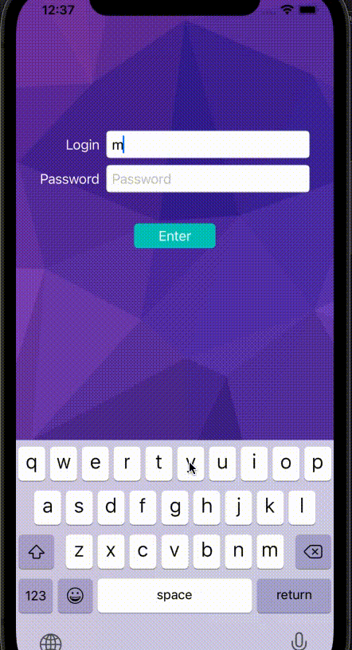

# CodingStyleLibrary

This library contains one propertywrapper to dynamically convert a string to a string with the appropriate formatting type. The library currently supports the following styles:
<ul>
    <li>camelCase</li>
    <li>snake_case</li>
    <li>kebab-case.</li>
</ul>

# For example:
<ul>
    <li>Camel case style: "Hello big world!" -> "helloBigWorld!"</li>
    <li>Snake case style: "Hello big world!" -> "hello_big_world!"</li>
    <li>Kebab case style: "Hello big world!" -> "hello-big-world!"</li>
</ul>



# Usage example:

```
import SwiftUI
import CodingStyleLibrary

struct SomeSwiftUIView: View {
    @CodingStyle(typeStyle: .kebabCase) var username: String = ""
    
    var body: some View {
        TextField(
            "User name (email address)",
            text: $username)
    }
}
```
